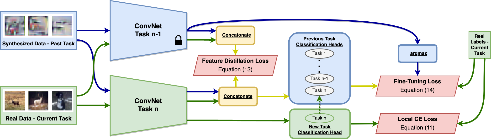

## (Coming September 2021) Always Be Dreaming: A New Approach for Data-Free Class-Incremental Learning
PyTorch code for the ICCV 2021 paper (Coming September 2021):\
**Always Be Dreaming: A New Approach for Data-Free Class-Incremental Learning**\
**_[James Smith]_**, Yen-Chang Hsu, [Jonathan Balloch], Yilin Shen, Hongxia Jin, [Zsolt Kira]\
International Conference on Computer Vision (ICCV), 2021\
[[arXiv]]

## Abstract
Modern computer vision applications suffer from catastrophic forgetting when incrementally learning new concepts over time. The most successful approaches to alleviate this forgetting require extensive replay of previously seen data, which is problematic when memory constraints or data legality concerns exist. In this work, we consider the high-impact problem of Data-Free Class-Incremental Learning (DFCIL), where an incremental learning agent must learn new concepts over time without storing generators or training data from past tasks. One approach for DFCIL is to replay synthetic images produced by inverting a frozen copy of the learner's classification model, but we show this approach fails for common class-incremental benchmarks when using standard distillation strategies. We diagnose the cause of this failure and propose a novel incremental distillation strategy for DFCIL, contributing a modified cross-entropy training and importance-weighted feature distillation, and show that our method results in up to a 25.1% increase in final task accuracy (absolute difference) compared to SOTA DFCIL methods for common class-incremental benchmarks. Our method even outperforms several standard replay based methods which store a coreset of images.

## Acknowledgement
This work is supported by Samsung Research America.

## Citation
If you found our work useful for your research, please cite our work:

    @article{smith2021always,
      title={Always Be Dreaming: A New Approach for Data-Free Class-Incremental Learning},
      author={Smith, James and Hsu, Yen-Chang and Balloch, Jonathan and Shen, Yilin and Jin, Hongxia and Kira, Zsolt},
      journal={arXiv preprint arXiv:2106.09701},
      year={2021},
      note={Accepted for publication at ICCV 2021}
    }

[James Smith]: https://jamessealesmith.github.io/
[Jonathan Balloch]: https://jballoch.com/
[Zsolt Kira]: https://www.cc.gatech.edu/~zk15/
[arXiv]: https://arxiv.org/abs/2106.09701
